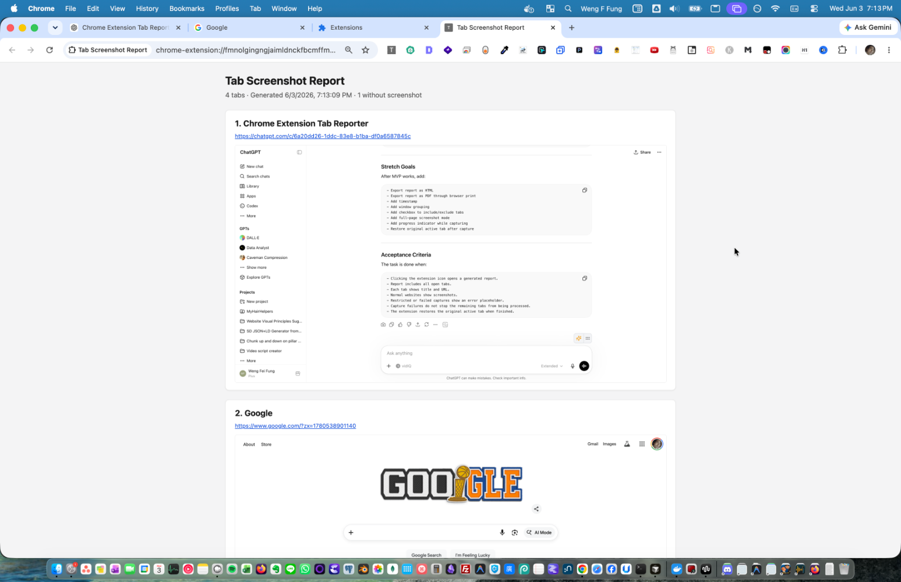
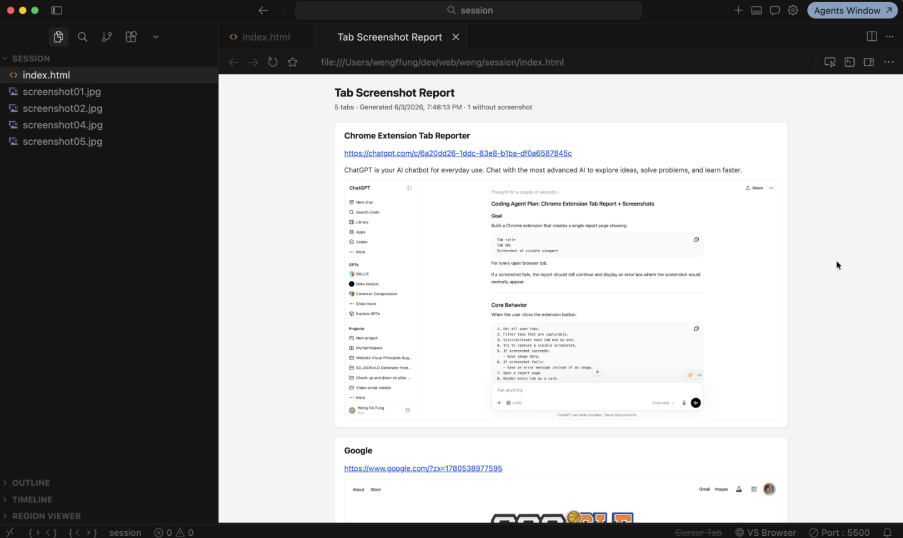

# All Tabs Screenshot Report

**By Weng (Weng Fei Fung)**

A Chrome extension that captures every open tab: URL, page title, meta description, and a screenshot. Then it assembles them into a single report you can review, reorder, export, or hand off. Built for research workflows and for giving AI agents (or teammates) rich, visual context without copying links one by one.

## What it does

Click the extension icon once. The extension visits each tab (briefly activating it), grabs a JPEG screenshot, reads the page’s meta description (`description`, Open Graph, or Twitter), and opens an in-browser report. From there you can switch between full-size and thumbnail layouts, drag cards to reorder, remove tabs you do not need, print, or **Export** a folder with `index.html` plus one image file per tab—ready to attach to a chat, drop into a repo, or archive offline.

## Use cases

### Research and literature review

When you are comparing papers, products, docs, or search results across many tabs, a tab report gives you one scrollable document: what each page claims (title + description), where it lives (URL), and what it actually looks like (screenshot). Reorder cards to match your outline, delete noise, then export or print so your notes and citations stay aligned with what you had open.

### Context for AI assistants and agents

Large language models and coding agents work better with **structured, multimodal context**: URLs alone miss layout and state; screenshots alone miss intent. This extension bundles **title, URL, description, and image** per tab into HTML/PNGs you can paste, upload, or point an agent at. Typical flows:

- **End-of-session handoff** — Before closing a long research or debugging session, generate a report and export it so the next prompt includes “here is everything I had open.”
- **Bug or UX triage** — Attach the export folder so the model sees the same UI states you saw, with URLs for reproduction.
- **Competitive / design review** — Capture a set of reference sites in one export instead of many separate screenshots and links.
- **Documentation drafts** — Use descriptions and screenshots as source material for write-ups; reorder tabs to match narrative order.

Export is self-contained (`index.html` + `screenshot01.jpg`, …), so tools that accept files or folders can ingest it without relying on live browser state.

### QA, bugs, and handoffs

Reproduce a multi-tab issue once, export the report, and share it with QA or engineering. Each card documents URL, summary text from the page, and visual state—useful when steps span several sites or when a single tab’s screenshot is not enough.

### Archives and personal knowledge

Snapshot “what was open” at a point in time (e.g. before a refactor, after a conference session, or when finishing a project). Stored reports live locally in the browser until you clear them or export for long-term storage.

## Quick start

1. Clone or download this repository.
2. Open `chrome://extensions`, enable **Developer mode**, choose **Load unpacked**, and select this folder.
3. On the extension card, set **Site access** to **On all sites** (required for capturing screenshots across tabs). Reload the extension if prompted.
4. With your tabs open, click the **Tab Screenshot Report** toolbar icon.
5. When the report tab opens, use **Export** to save a folder (Chrome/Edge with File System Access API) or **Print** for a PDF-friendly layout.

## Report features

| Feature | Description |
|--------|-------------|
| All tabs | Processes every tab in the browser (skips the extension’s own report page). |
| Meta descriptions | Pulled from standard `meta name="description"`, `og:description`, or `twitter:description`. |
| Screenshots | JPEG captures per tab; restricted URLs (`chrome://`, `file://`, etc.) show an error instead of an image. |
| Reorder / delete | Drag cards to reorder; delete removes a tab from the report only. |
| View modes | Full-size screenshots or compact thumbnail grid. |
| Export | `index.html` + `screenshotNN.jpg` in a folder you choose. |
| SEO details | Per-card **SEO** button in full view expands headings, keywords, and meta tags. |
| Local storage | Latest report is kept in IndexedDB until you **Clear stored report**. |

## Controlling export appearance

Export reflects the report as you have it arranged when you click **Export**:

| What you set in the report | What the export includes |
|----------------------------|--------------------------|
| **Full view** (default) | Full-size screenshots and card layout. |
| **Thumbnails** | Compact grid layout; SEO panels are omitted. |
| **SEO** toggled on for a card (full view only) | That card’s SEO block is written into `index.html`. |
| **SEO** left collapsed | No SEO block for that card in the export. |
| Card order after drag-and-drop | Same order in the exported HTML. |
| **Notes** on a card | Included when the note field has text. |
| Tabs removed with **Delete** | Omitted from the export. |

To include SEO for specific tabs only, stay in **Full view**, click **SEO** on each card you want documented, then **Export**. Thumbnail exports never include SEO, even if you expanded panels before switching views.

## Permissions

- **tabs**, **activeTab**, **scripting** — Enumerate tabs, activate them for capture, and read meta descriptions.
- **storage** — Persist the latest report and view preference.
- **host_permissions: `<all_urls>`** — Capture and describe pages on any site you can open in Chrome.

Screenshots cannot be taken on some built-in or restricted pages; those entries still appear in the report with an error message.

## Privacy

Processing runs locally in your browser. Reports and screenshots are stored in extension storage until you clear them or export them; nothing is sent to a backend by this extension.

## Development

Manifest V3 service worker: `background.js`. Report UI: `report.html`, `report.js`, `report.css`. Persistence: `report-storage.js` (IndexedDB, with migration from legacy `chrome.storage.local`).

## License

See repository license if present; otherwise treat as the author’s project—contact Weng Fei Fung for reuse terms.
